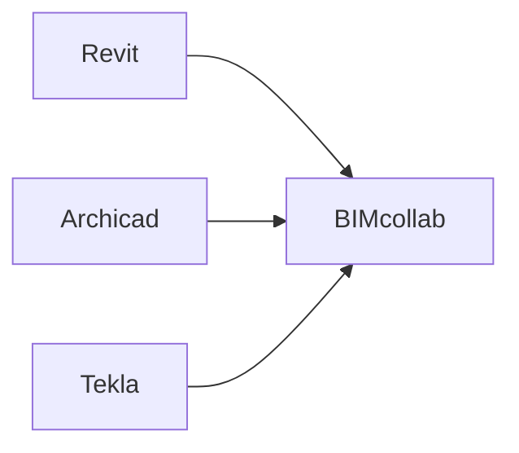

# 综合报告
工业数字化程度正在加速，对于OpenBIM解决方案和标准的要求也在增加。
buildingSMART之前常常把精力集中在建筑领域内的数据交换，现在，是时候把它推向更广的领域了。越来越多建筑领域外的用户、开发者和modellers想要在他们的流程和工具里用OpenBIM标准。随着智慧建筑、智慧城市和数据孪生等新概念的出现，人们对于未来的标准和解决方案有了更多的期待，这增加了对于大量数据的处理据交换的低延迟的要求，而当前基于本地文件的信息存储方式和人工智能、机器学习有相当大的脱节。
工业领域间的连接愈发强烈，基于当前现实，buildingSMART需要为数据格式、工具及底层技术创造可扩展的互操作性。
之前的IFC是基于文件的，但数字孪生、传感器、微服务、智慧城市对IFC提出了更高的要求，因此目前IFC新的工作方向是基于通用数据环境的（CDE）

## OpenBIM工作流
## OpenBIM名词解释
### IDS
IDS：IDS的最终目的是为了让人和计算机都能读懂BIM信息需求。使用IDS，我们可以制定哪些数据必须要包含在BIM模型中，并验证是否合规。
IDS是基于XML格式的

如何使用：模型作者可以使用IDS确保自己提供信息的规范性；接收模型的人则可以利用IDS检查IFC模型是否符合规范。

（自己的理解：现实情况中，自己发布的模型会缺失很多信息，比如防火属性、内外属性、承重属性等，如果模型传递给其他专业，如结构专业，这个模型是无法用于计算的，IDS就像模型作者和模型接收者之间的检察官，核算模型是否满足交付规范，实际上就是用编程的手段来对交付的模型属性进行挨个比对，如果结构专业要求有“承重属性”而建筑专业没有提供，那么就告诉建筑设计师：你需要对这面墙体赋予属性）

在没有ids之前，上下游之间进行信息交付的主要方式是通过xlsx、docx、pdf等格式，并由上游的人给下游的人进行解释，常常出现理解偏差，且整体验证阶段时间长。

## 第一步：使用IDS定义需求
这一步，你可以得到一个.xml文件
## 第二步：查看
利用BIM.works打开.xml文件，查看、修改需求
## 第三步：检查
检查后导出一个BCF文件

##使用Sketchup的bSDD的典型案例

不明白的地方：.ids格式和XML格式的区别是什么？

### bSDD（数据字典）
BIM建模员用bSDD来轻松有效地访问所有标准、丰富他们的模型；BIM经理用bSDD检查BIM数据的有效性；高级技术人员使用bSDD去进行合规性检查、查找产品制造商，创建IDS等。
bSDD不是一个标准，而是buildingSMART提供的一项服务，以更简单地去使用BIM和OpenBIM标准。

为什么要有这个东西？

## Oslo Airport

使用软件：Archicad、EDModelServer，Grasshopper,MicroStation V8i,Navigate SImple BIM,Navisworks,Novapoint,ProjectWise,Revit,Solibri Model Checker,StreamBIM,SYNCHROPRO,Tekla BIMsight,Tekla Structures,Trimble Connect,Vectorworks
交付格式：IFC 2*3
设计团队：Team-T
负责人：Aas Jakobsen

## The Pontsteiger Project
使用软件：Allplan,Archicad,BIMcollab,Docstream,Solibri Model Checker,Tekla Structures,Vectorworks
交付格式：IFC2*3,bcf
时间：2014年4月设计，2015年10月开工，2018年5月入住

## The Henderson -面向未来的办公建筑
设计师：扎哈团队

## openCDE通用数据环境
自己的理解：其实就是一个云协同平台，比较著名的有BIMcollab，在这个平台上，我们可以查看各个软件导入的模型、进行版本管理（模型更新，就是GIT的功能）、进行检测报告的输出（BCF文档可以通过插件直接被上述软件读取）、权限管理。
>流程1、Revit、Archicad、Navisworks、Autocad、Tekla几个软件的模型可以直接导入，其它软件的模型可以导成ifc的格式放到BIMcollab ZOOM上。
流程2、BIMcollab ZOOM利用IDS（一个.xml的文档）进行模型审核，如果缺失信息，直接发送BCF文件，让设计师增加信息后进行模型更新

## 通用数据环境和数据中台的比较
云协同平台并不进行IFC等模型的编辑，而是直接返回原来的软件进行编辑，分工比较明确。但是只能看，并不能对模型信息进行分发、重构。只是起到了BCF告知作用。我们的工作流则希望在导入IFC模型后，除了以上功能外，还能利用可视化编程工具对IFC信息进行批量化的编辑、以及实现对于其它专业模型的分发。
### 问题1：为什么要进行IFC模型的分发？
>答：结构专业需要看到建筑专业的IFC模型作为参考，如建筑专业的墙体、楼板等；设备专业则需要除了家具、配景以外的几乎所有模型。
### 问题2：那不能直接在Archicad中将结构、设备专业所需要的那部分模型导成IFC吗？还值得去写一个IFC过滤器？
>答：IFC的导出设置需要一定的门槛，对于各个专业的设计师不友好，我们通过封装减轻了设计师负担（理由不够充分）
### 问题3：为什么需要对IFC模型进行编辑？让各个专业的人在自己的BIM软件中去添加不行吗？
>答：
首先，对IFC进行编辑，我们想象的使用场景主要是对属性信息的批量修改。
其次，我们技术人员当然也可以直接调用Archicad、Revit等软件的接口，批量赋予属性，但是这要求我们技术人员对各个专业软件的API都很熟悉，现在这么做，我们只需要熟悉IFC一个格式的API就好了。

