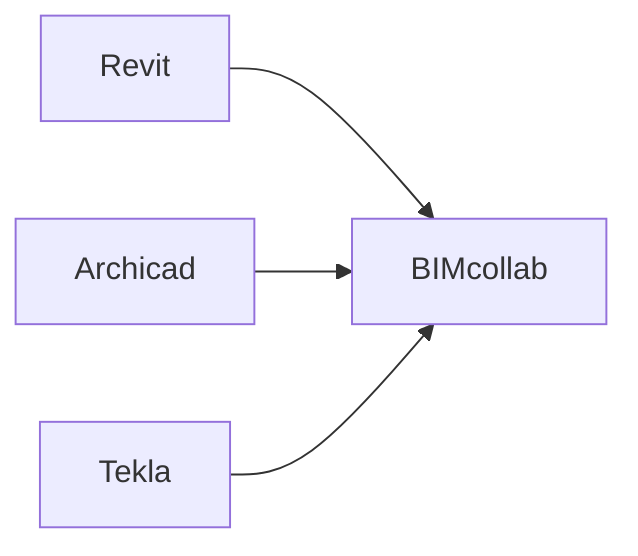

# 综合报告
工业数字化程度正在加速，对于OpenBIM解决方案和标准的要求也在增加。
buildingSMART之前常常把精力集中在建筑领域内的数据交换，现在，是时候把它推向更广的领域了。越来越多建筑领域外的用户、开发者和modellers想要在他们的流程和工具里用OpenBIM标准。随着智慧建筑、智慧城市和数据孪生等新概念的出现，人们对于未来的标准和解决方案有了更多的期待，这增加了对于大量数据的处理据交换的低延迟的要求，而当前基于本地文件的信息存储方式和人工智能、机器学习有相当大的脱节。
工业领域间的连接愈发强烈，基于当前现实，buildingSMART需要为数据格式、工具及底层技术创造可扩展的互操作性。
之前的IFC是基于文件的，但数字孪生、传感器、微服务、智慧城市对IFC提出了更高的要求，因此目前IFC新的工作方向是基于通用数据环境的（CDE）

# 3 目前的标准
## 3.1 IFC的演变
IFC一直是buildingSMART的标杆标准。它是buildingSMART最为成熟的标准，有着较长时间的历史，并且被许多软件所支持。IFC一直是用STEP技术进行定义，它有着一套高级的模型技术去高效地实现基于文件地数据交换。
### 3.1.1 下一代的IFC
当前IFC是基于文件形式的数据交换，但随着CDE、数字孪生、传感器、微服务、智慧城市等技术的发展，他们对IFC提出了新的要求。
无论是CDE还是数字孪生技术，都要求一个基于对象的（object-based）IFC数据交换形式。
### 3.1.2 未来IFC的计划
目前IFC数据模型和EXPERESS模型技术密切相关，这使得目前很难用STEP以外的技术来表示IFC，基于文件的数据交换优化已经有了先进的解决方案，但也有着很多负面作用：
1、结构中过多的依赖关系。要推导出最终的对象，你需要对多个依赖关系进行分析。
2、
3、未能优秀地消除歧义？
4、结构过于复杂，软件供应商需要花费极大的精力实现。

未来保证未来的IFC的成功，我们需要：
1、变得可预测和保持一致性
2、衍生出多个计算机语言体系，发展ifcJSON、ifcOWL、ifｃｘｍｌ等。这一步骤将提升ｉｆｃ对于其它领域的开放程度，为其它领域的人为ｉｆｃ的发展做贡献提供了土壤。
3、去除循环引用
4、变得更加模块化以促进在各个领域的增加及扩展，比如除了建筑领域以外，还能增加在桥梁、景观中的应用。

自己的理解：基于文件的IFC是架构在STEP技术上的，如果要进行改革，将需要对IFC与底层技术进行分离，相当多的STEP技术将不可用，但是为ｉｆｃ向其它领域的开放提供了土壤，意味着ｉｆｃ可以用ｘｍｌ等语言进行描述。

### 3.1.3 从整体到模块化
IFC最初专注于建筑行业的标准化和数据交换。它有一个“控制扩展”和“过程扩展”，但主要元素是来自“产品扩展”中的“建筑元素”。近年来，这个模式增加了越来越多的扩展，如铁路、公路、桥梁等，港口、隧道等也在开发中。
各专业软件并不需要完整的ifc数据，而只需要过滤后的部分数据，即目前的MVD（模型视图定义）。
但是MVD的方式是不可持续的，有如下原因：
１、用户不总是知道IFC数据是建立在MVD之上的
２、并很难理解为啥子模型之间不可交换
３、多个子模型也不能保证之间的互操作性
４、此外IFC的整体模式要求每个人发布的IFC版本都是一致的。
自己的理解：MVD限制太多，要扶着用，不是黑箱操作，所以很难普及。

解决方法是：模块化

### 3.1.4 向后兼容
### 3.1.5 标准化水平

## OpenBIM工作流
## OpenBIM名词解释
### IDS（Information Delivery Specification）信息交换规范
IDS：IDS的最终目的是为了让人和计算机都能读懂BIM信息需求。使用IDS，我们可以制定哪些数据必须要包含在BIM模型中，并验证是否合规。
IDS是基于XML格式的

如何使用：模型作者可以使用IDS确保自己提供信息的规范性；接收模型的人则可以利用IDS检查IFC模型是否符合规范。

（自己的理解：现实情况中，自己发布的模型会缺失很多信息，比如防火属性、内外属性、承重属性等，如果模型传递给其他专业，如结构专业，这个模型是无法用于计算的，IDS就像模型作者和模型接收者之间的检察官，核算模型是否满足交付规范，实际上就是用编程的手段来对交付的模型属性进行挨个比对，如果结构专业要求有“承重属性”而建筑专业没有提供，那么就告诉建筑设计师：你需要对这面墙体赋予属性）

在没有ids之前，上下游之间进行信息交付的主要方式是通过xlsx、docx、pdf等格式，并由上游的人给下游的人进行解释，常常出现理解偏差，且整体验证阶段时间长。

在openBIM中，IDS用于规范不同参与方之间的信息交换，确保项目中所有的BIM数据都按照一致的标准进行交流和处理。IDS定义了参与方在特定阶段需要交换的信息和数据的细节和标准，包括建筑模型、文件格式、数据结构、文件命名和版本控制等方面。

IDS可以在BIM项目的不同阶段（如概念设计、详细设计、施工、运营等）使用，以确保在每个阶段需要的信息都能得到准确、及时地交换和使用。IDS的使用可以提高项目的协作效率，降低信息交流过程中的错误和重复工作，从而提高BIM项目的质量和效率。

## 第一步：使用IDS定义需求
这一步，你可以得到一个.xml文件
## 第二步：查看
利用BIM.works打开.xml文件，查看、修改需求
## 第三步：检查
检查后导出一个BCF文件

##使用Sketchup的bSDD的典型案例

不明白的地方：.ids格式和XML格式的区别是什么？

### bSDD（数据字典）
BIM建模员用bSDD来轻松有效地访问所有标准、丰富他们的模型；BIM经理用bSDD检查BIM数据的有效性；高级技术人员使用bSDD去进行合规性检查、查找产品制造商，创建IDS等。
bSDD不是一个标准，而是buildingSMART提供的一项服务，以更简单地去使用BIM和OpenBIM标准。

自己的理解：https://search.bsdd.buildingsmart.org/网站上感觉就像新华字典一样，对IFC的某个概念不理解了，就可以进行查询其具体含义

为什么要有这个东西？
>答：不同的组织、国家用不同的术语描述同一个东西，bSDD就好像秦始皇的“书同文”一样，对构件名称进行了严格的定义以避免歧义。bSDD是一个在线平台

## Oslo Airport

使用软件：Archicad、EDModelServer，Grasshopper,MicroStation V8i,Navigate SImple BIM,Navisworks,Novapoint,ProjectWise,Revit,Solibri Model Checker,StreamBIM,SYNCHROPRO,Tekla BIMsight,Tekla Structures,Trimble Connect,Vectorworks
交付格式：IFC 2*3
设计团队：Team-T
负责人：Aas Jakobsen

## The Pontsteiger Project
使用软件：Allplan,Archicad,BIMcollab,Docstream,Solibri Model Checker,Tekla Structures,Vectorworks
交付格式：IFC2*3,bcf
时间：2014年4月设计，2015年10月开工，2018年5月入住

## The Henderson -面向未来的办公建筑
设计师：扎哈团队

## openCDE通用数据环境
自己的理解：其实就是一个云协同平台，比较著名的有BIMcollab，在这个平台上，我们可以查看各个软件导入的模型、进行版本管理（模型更新，就是GIT的功能）、进行检测报告的输出（BCF文档可以通过插件直接被上述软件读取）、权限管理。
>流程1、Revit、Archicad、Navisworks、Autocad、Tekla几个软件的模型可以直接导入，其它软件的模型可以导成ifc的格式放到BIMcollab ZOOM上。
流程2、BIMcollab ZOOM利用IDS（一个.xml的文档）进行模型审核，如果缺失信息，直接发送BCF文件，让设计师增加信息后进行模型更新

## 通用数据环境和数据中台的比较
云协同平台并不进行IFC等模型的编辑，而是直接返回原来的软件进行编辑，分工比较明确。但是只能看，并不能对模型信息进行分发、重构。只是起到了BCF告知作用。我们的工作流则希望在导入IFC模型后，除了以上功能外，还能利用可视化编程工具对IFC信息进行批量化的编辑、以及实现对于其它专业模型的分发。
### 问题1：为什么要进行IFC模型的分发？
>答：结构专业需要看到建筑专业的IFC模型作为参考，如建筑专业的墙体、楼板等；设备专业则需要除了家具、配景以外的几乎所有模型。
### 问题2：那不能直接在Archicad中将结构、设备专业所需要的那部分模型导成IFC吗？还值得去写一个IFC过滤器？
>答：IFC的导出设置需要一定的门槛，对于各个专业的设计师不友好，我们通过封装减轻了设计师负担（理由不够充分）
### 问题3：为什么需要对IFC模型进行编辑？让各个专业的人在自己的BIM软件中去添加不行吗？
>答：
首先，对IFC进行编辑，我们想象的使用场景主要是对属性信息的批量修改。
其次，我们技术人员当然也可以直接调用Archicad、Revit等软件的接口，批量赋予属性，但是这要求我们技术人员对各个专业软件的API都很熟悉，现在这么做，我们只需要熟悉IFC一个格式的API就好了。

# COBie相关
>自己的理解：COBie实际就是精简版的IFC数据，并以可读性强的表格进行呈现。
>答：COBie（Construction Operations Building Information Exchange）和IFC（Industry Foundation Classes）都是用于建筑信息建模（BIM）中的数据格式，但它们在数据交换和管理方面有不同的特点。

以下是 COBie 和 IFC 的一些比较：

数据格式：COBie 是一种电子表格格式，其中包含了建筑信息的各种数据，如建筑元素、材料、设备、维护和保养信息等。而 IFC 是一种面向对象的数据格式，其中包含了建筑元素、关系和属性等各种信息。IFC 中的数据是以面向对象的方式进行描述，而 COBie 中的数据则是以电子表格的形式进行组织和呈现的。

信息的详细程度：IFC 提供了更详细的建筑信息，包括元素的几何形状、材料、性能等信息。而 COBie 则提供了更加简化的建筑信息，例如设备的名称、型号、位置、安装日期等信息。

用途：IFC 的主要用途是在不同的 BIM 软件之间进行数据交换，以便在不同的软件中查看和修改建筑信息模型。而 COBie 则主要用于建筑信息管理和交换，例如在建筑项目的各个阶段中传递建筑信息、进行建筑信息管理等。

实施难度：IFC 的实施需要一定的技术知识，包括软件开发、数据结构设计等方面的知识。而 COBie 的实施则相对简单，只需要掌握电子表格的基本使用和建筑信息管理的知识。

综上所述，COBie 和 IFC 在建筑信息建模和数据交换方面有不同的特点和用途。选择哪种数据格式，取决于具体的应用场景和需求。

## IDM（Information Delivery Manual）信息交付手册
整体为ISO 29481-1中的主要内容
IDM可以是word、pdf、excel、xml等多种形式。
IDM通常包含以下内容：

项目的信息需求和信息目标；
项目中使用的BIM标准和规范，例如文件格式、对象属性、分类系统、命名规则等；
项目中涉及到的信息交换流程，包括交换的时间表、数据格式、传输方式等；
参与方之间的责任和义务，例如数据质量控制、版本管理、合作协议等。

## openBIM流程

1、根据ISO 29481-1中IDM的章节，定义项目需求和目标。
2、创建BIM模型：使用BIM工具创建建筑模型，例如Revit，Archicad等。模型需要遵循开放的BIM标准，如IFC（Industry Foundation Classes）等。
3、模型协调：利用BIMcollab和solibri进行碰撞检查、模型协作
4、模型分析：利用BIMcollab进行模型导出，可以导出成IFC格式，以供分析软件进行分析，如Energy plus等

## ifcDoc

ifcDoc允许用户在不需要编写代码的情况下，通过直观的界面进行IFC文档的编辑和检查。用户可以通过ifcDoc的各种工具，如IFC属性编辑器、IFC关系编辑器和IFC查询器等，对IFC文档进行详细的编辑和检查。

## BCF(BIM Collaboration Format)
是一种用于在BIM项目中共享问题和信息的开放格式，可以包含模型中的任何信息，如问题描述、截图、链接等。
是一种特定用途的xml格式，但后缀是.bcf或者.bcfzip

## ifcxml
是ifc的一种特定形式，可以更容易地转换为其它xml格式，以支持数据地进一步处理。同理，ifcjson也是一样的道理，可以转换成json格式，使得它在web中更容易使用。

## ifcSPFF
可以理解为压缩比较高、传输速度快的ifc替代品，但是不易直接产看和编辑，需要通过IFC解析软件进行解析和处理。